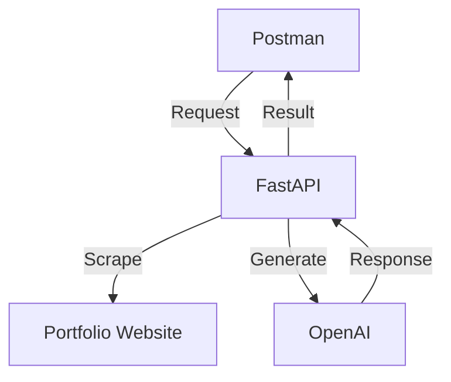

# Cover Letter Generator API

An intelligent API that generates personalized cover letters by analyzing your portfolio website using FastAPI and OpenAI's GPT models.

## Features

- Portfolio website content scraping and analysis
- Intelligent cover letter generation using GPT models
- Support for multiple writing tones (professional/confident)
- RESTful API interface
- Automatic markdown formatting

## Technical Architecture



## Prerequisites

- Python 3.7+
- OpenAI API key
- Virtual environment (recommended)
- Postman (for testing)

## Installation

1. Clone the repository:
```bash
git clone <repository-url>
cd cover-letter-generator
```

2. Create and activate virtual environment:
```bash
# Create virtual environment
python -m venv venv

# Activate virtual environment
# Windows
venv\Scripts\activate
# macOS/Linux
source venv/bin/activate
```

3. Install dependencies:
```bash
pip install -r requirements.txt
```

4. Create `.env` file:
```env
OPENAI_API_KEY=your_openai_api_key_here
```

## Usage

1. Start the server:
```bash
uvicorn main:app --reload
```

2. The API will be available at `http://127.0.0.1:8000`

3. API Endpoints:

- `GET /` - Welcome message
- `POST /generate-cover-letter` - Generate cover letter

4. Example request body:
```json
{
    "applicant_name": "Sandy Lauguico",
    "portfolio_url": "https://sailauguico.io",
    "job_title": "Senior AI/ML Engineer",
    "company_name": "TechCorp",
    "key_skills": ["Python", "Data Engineering", "Machine Learning"],
    "tone": "professional"
}
```

5. Example response:
```json
{
    "cover_letter": "# Cover Letter\n\n[Generated markdown content...]"
}
```

## Testing

### Using FastAPI Documentation

1. Visit `http://127.0.0.1:8000/docs`
2. Navigate to the `/generate-cover-letter` endpoint
3. Click "Try it out"
4. Input your request payload
5. Click "Execute"

### Using Postman

1. Create a new POST request to `http://127.0.0.1:8000/generate-cover-letter`
2. Set request body to raw JSON
3. Input your request payload
4. Send request

## Project Structure

```
cover-letter-generator/
├── README.md
├── requirements.txt
├── .env
└── main.py
```

## Configuration

Available configuration options in `.env`:
- `OPENAI_API_KEY` - Your OpenAI API key

## Troubleshooting

### Common Issues

1. **ModuleNotFoundError**
```bash
pip install fastapi uvicorn openai requests beautifulsoup4 python-dotenv
```

2. **Connection Refused**
- Check if server is running
- Verify correct port (8000)
- Ensure URL is correct

3. **OpenAI API Error**
- Verify API key in `.env`
- Check OpenAI API status
- Ensure proper model access

## Contributing

1. Fork the repository
2. Create your feature branch
3. Commit your changes
4. Push to the branch
5. Create a new Pull Request

## License

MIT License - see LICENSE file for details

## Authors

- Sandy Lauguico

## Acknowledgments
- Ed Donner for use case idea
- Manifold AI Learning for the technical implementation